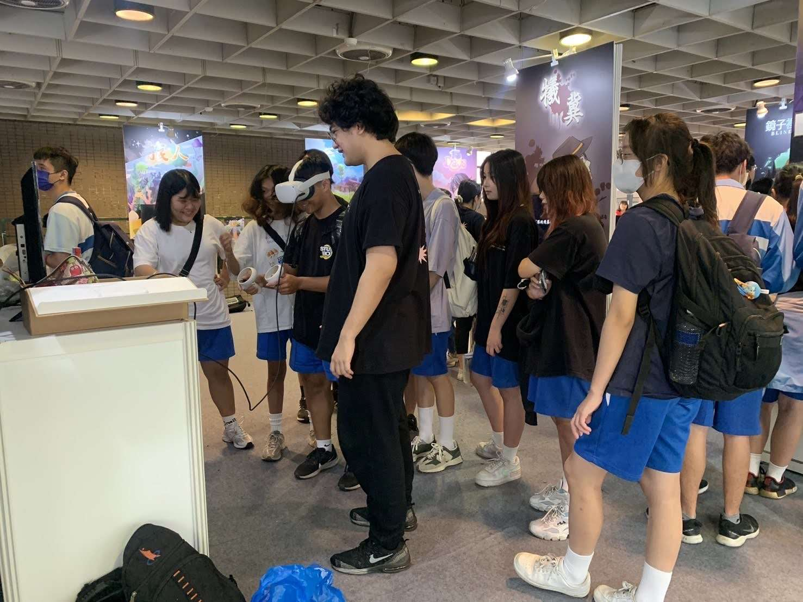

# VR 解謎遊戲｜開發紀錄與設計回顧

> 🧠🔍 本專案為一款虛擬實境（VR）解謎遊戲，已於 2024 年完成。
> 本倉庫用於整理開發思路與設計歷程，**不包含遊戲原始碼與素材**。

---

## 🎮 遊戲簡介

本遊戲為第一人稱視角的 VR 解謎體驗，玩家將置身於一座充滿謎團的場景中，透過觀察環境、操作機關與邏輯推理來推進劇情。
設計上注重「直覺操作」與「沉浸感」，適合追求沉浸式互動體驗的玩家。

[觀看遊戲展示影片 (點擊觀看)](https://youtu.be/qXsdbeFwIuY?si=amonb6-xs8z1qoff)

---

## 🛠️ 技術實作

| 分類     | 使用技術 / 工具 |
| -------- | --------------- |
| 遊戲引擎 | Unreal 5.3      |
| VR 裝置  | Meta Quest 2    |
| 3D 建模  | Blender         |
| 音效處理 | Audacity        |
| 專案管理 | onedrive        |

## 💻 系統需求與安裝說明

### 系統需求
- **遊玩平台**：PC/VR
- **作業系統**：Windows 10/11 64位元
- **處理器**：Intel i5-6400 或 AMD Ryzen 5 1600 以上
- **記憶體**：8GB RAM 以上
- **顯示卡**：NVIDIA GTX 1060 6GB 或 AMD RX 580 8GB 以上
- **儲存空間**：需要 2GB 可用空間
- **VR 裝置**：兼容市面上的大多數裝置 推薦使用Meta Quest 2

### 安裝與執行步驟

1. 下載 `mistory3.zip` 壓縮檔
2. 將檔案解壓縮到您想要的位置
3. 連接並設定好 Meta Quest 裝置：
   - 確保 Meta Quest 已開啟並連接至電腦
   - 開啟 Meta Link 並確認連線狀態
4. 執行解壓縮後資料夾中的 `mistory3.exe`
5. 戴上 VR 頭盔，開始遊戲體驗

### 注意事項
- 首次執行時可能需要允許防火牆權限
- 建議在遊玩前先確保有足夠的活動空間（建議 2m x 2m 以上）
- 如遇到執行問題，請確認是否已安裝最新的顯示卡驅動程式

---

## 🎨 美術與關卡設計

- 風格設定：低飽和寫實風格，營造神秘與沉靜氛圍
- 場景構成：分為 2 個主要場景，每區域搭配專屬主題與互動方式
- 關卡原型：使用灰盒測試（Grayboxing）驗證遊玩流程與視線引導

---

## 📈 開發過程回顧

 專案期間：約 2 個禮拜（2024.05 ~ 2024.05）

#### **團隊組成**

- 程式：[安若殊](https://noveres.github.io/)
- 美術：[魏綸志](https://slimedark5565.artstation.com/)

#### **開發過程中的故事與解決方案**：

### 💡 **直覺操作的啟發：**

  在早期測試時，玩家很多時後完全不看教學就開始探索遊戲，我們意識到最好的教學不是文字說明，而是環境本身。於是我們將所有基礎操作融入自然探索中 —— 玩家需要伸手觸碰一個很明確的**按鈕**才能開始遊戲，這個簡單動作就教會了「伸手互動」的核心玩法。

  🌀 **如何克服 VR 暈眩問題：**
  「這玩起來好暈...」是我們初期測試中最常收到的玩家回饋。經過深入研究與反覆實驗，我們發現單純採用傳送移動雖能有效避免暈眩，但會顯著降低遊戲的沉浸感。透過參考《The Room VR》等優秀作品的設計，我們最終開發出三層移動機制：自由行走、定點傳送與漸進式位移。同時引入可調整的視野限制功能，讓玩家能依個人耐受度自由設定，成功在沉浸體驗與舒適度之間取得平衡。

  💪 **以創意突破資源限制**
  從零開始的VR開發之路並不容易。當初面對「完全沒有VR開發經驗」的困境時，我們沒有退縮，反而將這份挑戰轉化為動力。透過每週固定的技術研究時間，從基礎的VR互動設計開始，一步步掌握Unreal引擎的VR開發流程。在這兩年間，我們經歷過無數次的嘗試與失敗，但每一次的挫折都成為寶貴的學習經驗。最終這款看似只花了兩週完成的作品，其實凝聚了我們兩年來的技術積累與創新嘗試，印證了只要持續學習、勇於突破，就沒有跨過不去的技術門檻。

  🤝 **凝聚團隊的秘訣**
  團隊從五人一起學習和累積的過程，是我們最寶貴的成長經歷，每週四一起研究產品、寫報告發表自己的靈感，那段時間是真的很開心，雖然團隊因為技術門檻、人力分配不當、開發週期的壓力逐漸瓦解，但留下的兩位成員並未放棄。我們重新審視專案目標，將壓力轉化為動力，決定做畢業前的最後一次嘗試。這個決定讓我們更加專注於核心玩法，反而促使我們打造出一款精煉而富有特色的作品。這款遊戲不僅獲得最多玩家的喜愛，更證明了小團隊也能在缺乏資金與經驗的情況下創造出優秀的作品。

 **成果展示**：
 

- 測試玩家平均遊玩時間：5~10 分鐘

 **個人成長與收穫**：

- *學到的技能*：
  - Unreal Engine：掌握了 VR 互動系統開發，包括手部追蹤、物件抓取等功能實現
  - 場景優化：學會了的 LOD 設置、光照烘焙、材質優化等性能調校技巧

- *對開發流程的理解*：
  - 敏捷開發實踐：每週進行原型測試與迭代，根據玩家回饋快速調整設計方向
  - 效能優化流程：建立了從效能分析到優化的標準流程，包括幀率監控、記憶體管理等
  - 跨專業溝通：學會了如何與美術溝通設計需求，並有效整合各自的專業優勢

- *特別有成就感的部分*：
  - 成功解決 VR 暈眩問題：開發出兼顧沉浸感與舒適度的移動系統，獲得玩家好評
  - 打造直覺的互動體驗：設計出不需教學就能理解的環境互動機制
  - 玩家打從心底的喜歡，並且提出的意見第二天都能實裝

---
### 🎨 使用素材

| 類型   | 用途說明         | 購買連結                                                                                            |
| ---- | ------------ | ----------------------------------------------------------------------------------------------- |
| 場景模型 | 主要場景的建築結構與傢俱 | [Gothic Interior Megapack](https://www.fab.com/listings/c856b256-c060-4337-8156-8b604ce0cadd)   |
| 材質包  | 牆面、地板等基礎材質   | [Apocalyptic Hospital](https://www.fab.com/zh-cn/listings/84e5ee9c-1b14-4cd3-b4c3-731117221e1c) |
| 音效素材 | 環境音效與互動音效    | [Adobe](https://www.adobe.com/products/audition/offers/adobeauditiondlcsfx.html)                |

*註：以上素材僅供參考。實際專案可能使用不同版本或替代資源。*

---

## 🔒 關於原始碼與素材

本倉庫僅作為公開說明用途，不包含遊戲原始碼、素材與建置檔案。
如需了解技術細節或進一步洽談展示，歡迎聯絡我。

---

## 📬 聯絡方式

安若殊｜[LinkedIn](https://www.linkedin.com/in/noveres/)｜[個人網站](https://noveres.github.io/)｜[Email：andrew901117@gmail.com](https://mail.google.com/mail/?view=cm&to=andrew901117@gmail.com)

魏綸志｜[LinkedIn](https://www.linkedin.com/in/guan-jhih-wei-044853324)｜[個人網站](https://slimedark5565.artstation.com/)｜[Email：slimeblock5565@gmail.com](https://mail.google.com/mail/?view=cm&to=slimeblock5565@gmail.com)

歡迎交流設計與開發心得 🙌
